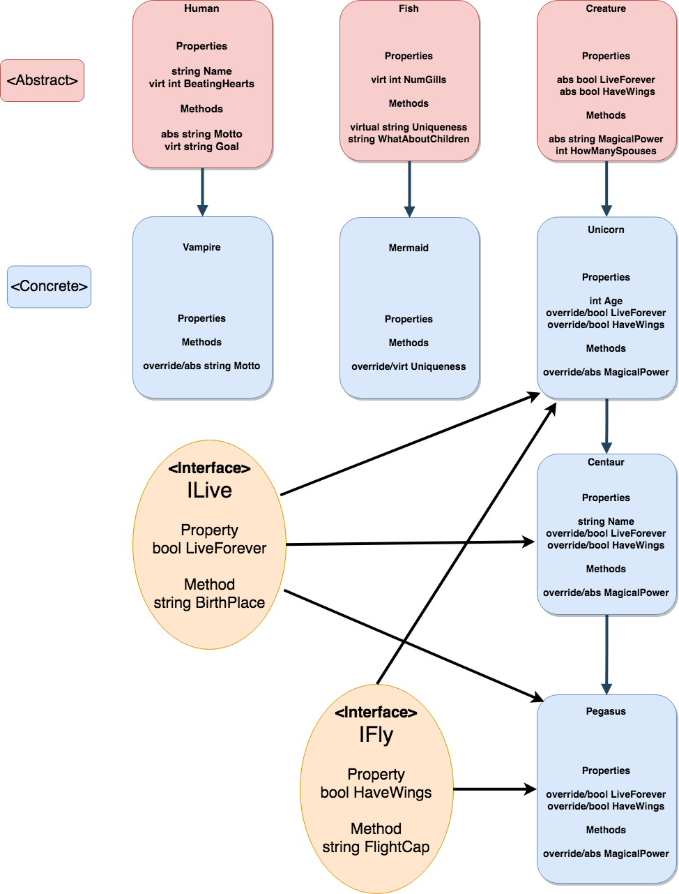

### Lab05 Build a Zoo

## Challenge
Create a zoo hierarchy class structure that uses all four principles of object-oriented programming. The requirements are as follows:
- 3 different abstract classes
- 3 layers of inheritance
- 5 concrete animals
- 2 abstract methods
- 2 abstract properties
- 2 virtual methods (override one of them)
- 2 virtual properties (override one of them)

## Diagram

## Object-Oriented Programming Principles
1. Abstraction - Break down into smaller components such as classes that are used to describe the characteristics of an object that differ from others.
	Example: instantiation of animal objects

2. Polymorphism - This allows multiple methods to exist but with different functionality.
	Example: Unicorn, Centaur, and Pegasus classes override the Creature method for MagicalPower

3. Inheritance - This describes how objects can relate to each other and pass properties and functionality to derived classes.
	Example: Unicorn class inherits properties and methods from the Creature class

4. Encapsulation - This allows data to be restricted or permit access to everyone.
	Example: public access modifier used in all the classes allow access to the properties and methods to other functions and objects

## Interfaces
An interface contains a group of behaviors that multiple classes can implement.

IFly interface - used by an animal class that has the ability to fly because of the property of wings and the method FlightCapability. It is implemented by the Unicorn and Pegasus classes because they have wings.

ILive interface - used by an animal class that has the property of eternal life and the method BirthPlace. It is implemented by the Vampire, Centaur, and Pegasus classes because they live forever. 